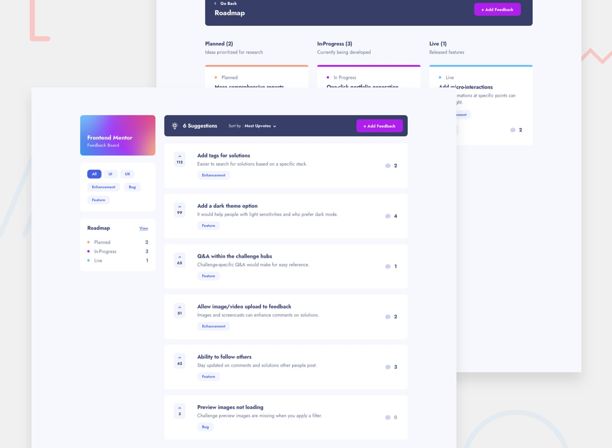

# Frontend Mentor - Product feedback app

This is a solution to the [Product feedback app challenge on Frontend Mentor](https://www.frontendmentor.io/challenges/product-feedback-app-wbvUYqjR6). Frontend Mentor challenges help you improve your coding skills by building realistic projects.

## Table of contents

- [Overview](#overview)
  - [The challenge](#the-challenge)
  - [Screenshot](#screenshot)
  - [Links](#links)
- [My process](#my-process)
  - [Built with](#built-with)
  - [What I learned](#what-i-learned)
  - [Continued development](#continued-development)
- [Author](#author)

## Overview

### The challenge

Users should be able to:

- View the optimal layout for the app depending on their device's screen size
- See hover states for all interactive elements on the page
- Create, read, update, and delete product feedback requests
- Receive form validations when trying to create/edit feedback requests
- Sort suggestions by most/least upvotes and most/least comments
- Filter suggestions by category
- Add comments and replies to a product feedback request
- Upvote product feedback requests
- **Bonus**: Keep track of any changes, even after refreshing the browser (`localStorage` could be used for this if you're not building out a full-stack app)

### Screenshot

### Links

- Solution URL: [https://www.frontendmentor.io/solutions/react-app-for-desktop-implementing-session-storage-tmkQdYZRQ](https://www.frontendmentor.io/solutions/react-app-for-desktop-implementing-session-storage-tmkQdYZRQ)
- Live Site URL: [https://thirsty-clarke-9a6686.netlify.app/](https://thirsty-clarke-9a6686.netlify.app/)

## My process

### Built with

- React, JSX
- Hooks, Context, Router
- Session storage
- CSS custom properties
- Flexbox
- Figma for design
- Netlify for deployment

### What I learned

My goal with this project was to just build a React project, as the last few projects have been vanilla JavaScript. Just wanted to continue working, learning, improving, make something similar to my last React app, and see how I'm progressing. I wanted to focus on keeping components and functions small and clean.

### Continued development

I would like to write more unit tests, starting with this project. I'll likely go back through all my previous apps and add unit tests where I can.

## Author

- [Jesse's Portfolio Website](https://www.codebyronda.com)
- [Jesse's LinkedIn Profile](https://www.linkedin.com/in/jesse-ronda-46a6a1205)
- [Jesse's Frontend Mentor Profile](https://www.frontendmentor.io/profile/jesse10930)
